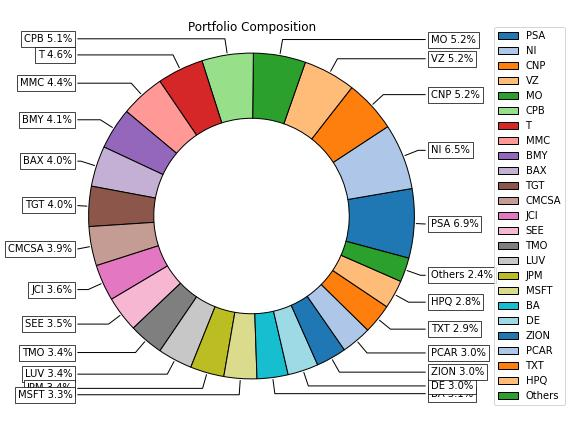
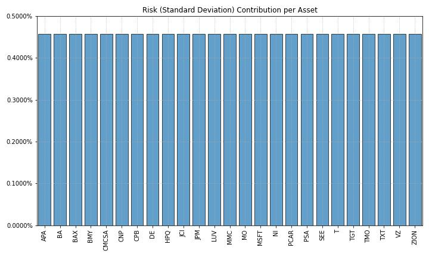
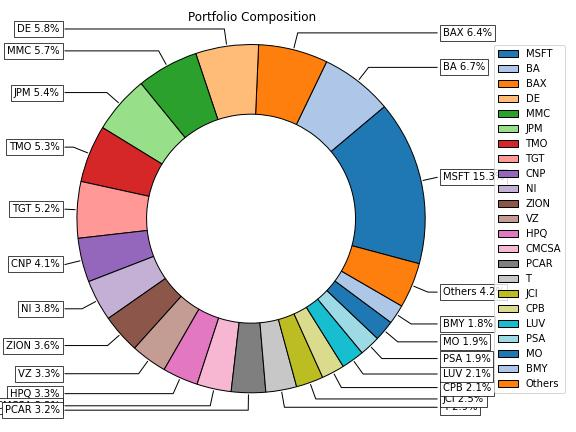
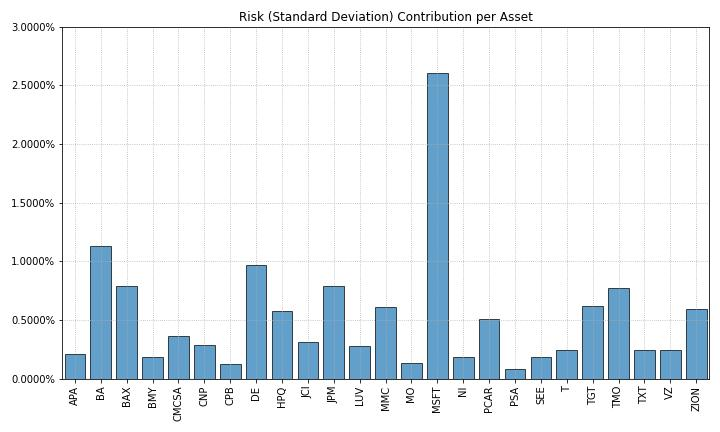

# Build your own risk parity portfolio

Risk parity is a strategy that uses risk to find the allocations of an investment portfolio. It allocates money to stocks based on a target risk level – usually volatility.

In other words, instead of equal dollar weights, risk parity portfolios have equal risk weights.

The first asset manager to use risk parity at scale was Bridgewater Associates in the 1990s. Their risk parity fund now has $25,000,000,000 under management. Risk parity is a complex strategy used by some of the most sophisticated investors in the world.

### The goal of risk parity is to earn the optimal level of return at a targeted risk level

The problem with dollar-weighted portfolios is not every stock has the same risk. That means if you equally weigh two stocks, but one has higher risk, portfolio returns will be dominated by the higher-risk stock. Investors use risk parity to avoid this problem.

Key Takeaways:

- Get stock data
- Create a portfolio with equal risk weights
- Create a portfolio with a minimum return constraint

---

Import Libraries:

    Yfinance

    riskfolio

    warnings
    
Riskfolio-Lib prints out some warnings that are safe to ignore. So ignore them.    

---

**File:** [Risk Parity Portfolio](RiskParityPortfolio.ipynb)

---

## Step 1: Get the data

Use the yFinance library to get data

For this example we will work with a basket of assets adjusted closing price using the built in pct_change() function for non compounding daily returns

assets = ["JCI", "TGT", "CMCSA", "CPB", "MO", "APA", "MMC", "JPM",
          "ZION", "PSA", "BAX", "BMY", "LUV", "PCAR", "TXT", "TMO",
          "DE", "MSFT", "HPQ", "SEE", "VZ", "CNP", "NI", "T", "BA"]

---

## Step 2: Create a portfolio with equal risk weights

Setup a portfolio with equal risk weights. 
This means Riskfolio-Lib will find the weights that cause the risk contribution of each stock to be equal.

First, build the portfolio object with the stock returns. 
Then estimate the expected returns and covariance based on historic data. 
Finally, use the classical mean-variance optimization to find the risk parity weights.

**Riskfolio-Lib makes it easy to visualize the weights.**

You can see the weight of each stock is not equal. That’s because the portfolio is risk-weighted. Higher-risk stocks have lower weights to maintain the overall portfolio risk target.

What about the risk contributions?

**Plot the risk contribution for each asset is equal**

They’re equal! That’s exactly what to expect.

---

## Step 3: Create a portfolio with a minimum return constraint

A criticism of risk parity is that without leverage, returns lag. 
Add a constraint to weight the stocks in a way to reach a minimum portfolio return. 
This adds weight to higher-risk stocks to push the portfolio returns higher.

Estimate the optimal portfolio with risk parity with the constraint

**Add a constraint for the minimum level of expected returns for the entire portfolio.**

MSFT dominates with a 15.3% weight. That’s because to reach the minimum return threshold, risk parity overweights stocks with higher risk. And with higher risk comes higher return.

**Plot the minimum level risk contributions per asset**

They’re no longer equal. That’s because risk parity figured out the optimal risk weights to hit the minimum portfolio return constraint.

Risk parity is a great way to manage a predictable portfolio that performs consistently in most markets.

<!-- Richie Garafola 12/16/222 -->
